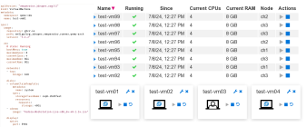

# Run QEMU/KVM in Kubernetes Pods

This project provides an easy to use and flexible solution for running
QEMU/KVM based VMs in Kubernetes pods.

The central component of this solution is the kubernetes operator that
manages "runners". These run in pods and are used to start and manage
the QEMU/KVM process for the VMs (optionally together with a SW-TPM).

A web GUI for administrators provides an overview of the VMs together
with some basic control over the VMs. A web GUI for users provides an
interface to access and optionally start, stop and reset the VMs.

Advanced features of the operator include pooling of VMs and automatic
login.

See the [project's home page](https://vm-operator.jdrupes.org/)
for details.
