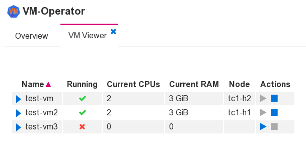

# The Web-GUI

*Planned for version 2.0, preview (alpha) version available.*

The manager component provides a GUI via a web server.



By default, the service is made available at port 8080. Of course,
a kubernetes service and an ingress configuration must be added as
required by the environment.

The web GUI is implemented using components from the
[JGrapes WebConsole](https://mnlipp.github.io/jgrapes/WebConsole.html)
project. Configuration of the GUI therefore follows the conventions
of that framework.

```yaml
"/Manager":
  # "/GuiSocketServer":
  #   port: 8080
  "/GuiHttpServer":
    # This configures the GUI
    "/ConsoleWeblet":
      "/WebConsole":
        "/LoginConlet":
          users:
            admin:
              fullName: Administrator
              password: "Generate hash with bcrypt"
            # Not needed, provided as example only:
            test:
              fullName: Test Account
              password: "Generate hash with bcrypt"
        "/RoleConfigurator":
          rolesByUser:
            # User admin has role admin
            admin:
            - admin
            # All users have role other
            "*":
            - other
          replace: false
        "/RoleConletFilter":
          conletTypesByRole:
            # Admins can use all conlets
            admin:
            - "*"
            # Others cannot use any conlet
            other: []
```

How users can be configured should be obvious from the example. Details
can be found in the JGrapes Webconsole's documentation of the components.
