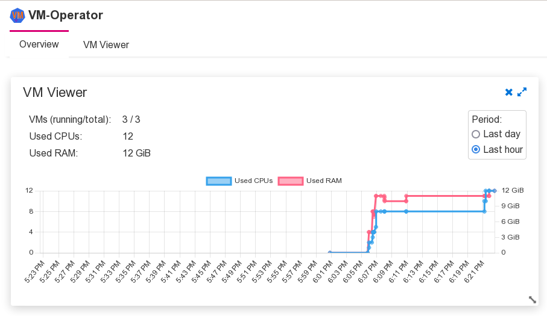
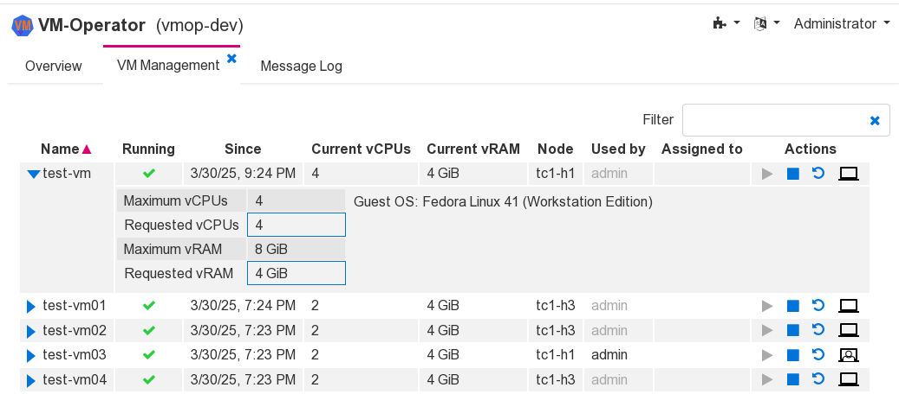

# Administrator view

An overview display shows the current CPU and RAM usage and a graph
with recent changes.

The detail display lists all VMs. From here you can start and stop
the VMs and adjust the CPU and RAM usages (modifies the definition
in kubernetes).

