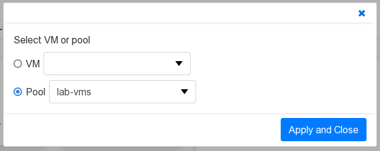
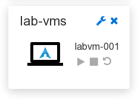

# VM Pools

*Since 4.0.0*

Not all VMs are defined as replacements for carefully maintained
individual PCs. In many workplaces, a standardardized VM configuration
can be used where all user-specific data is stored in each user's home
directory. By using a shared file system for home directories, users
can login on any VM and find themselves in their personal
environment.

If only a subset of users require access simultaneously, this makes it
possible to define a pool of standardardized VMs and dynamically assign
them to users as needed, eliminating the need to define a dedicated VM
for each user.

## Pool definitions

The VM-operator supports this use case with a CRD for pools.

```yaml
apiVersion: "vmoperator.jdrupes.org/v1"
kind: VmPool
metadata:
  namespace: vmop-dev
  name: test-vms
spec:
  retention: "PT4h"
  loginOnAssignment: true
  permissions:
  - user: admin
    may:
    - accessConsole
    - start
  - role: user
    may:
    - accessConsole
    - start
```

The `retention` specifies how long the assignment of a VM from the pool to
a user remains valid after the user closes the console. This ensures that
a user can resume work within this timeframe without the risk of another
user taking over the VM. The time is specified as
[ISO 8601 duration](https://en.wikipedia.org/wiki/ISO_8601#Durations).

Setting `loginOnAssignment` to `true` triggers automatic login of the
user (as described in [section auto login](auto-login.html)) when
the VM is assigned. The `permissions` property specifies the actions
that users or roles can perform on assigned VMs.

VMs become members of one (or more) pools by adding the pool name to
the `spec.pools` array, as shown below:

```yaml
apiVersion: "vmoperator.jdrupes.org/v1"
kind: VirtualMachine

spec:
  pools:
    - test-vms
```

## Accessing a VM from the pool

Users can access a VM from a pool using the widget described in
[user view](user-gui.html). The widget must be configured to
provide access to a pool instead of to a specific VM.

{: width="500"}

Assignment happens when the "Start" icon is clicked. If the assigned VM
is not already running, it will be started automatically. The assigned
VM's name apears in the widget above the action icons. 



Apart from showing the assigned VM, the widget behaves in the same way
as when configured for accessing a specific VM.

## Guest OS Requirements

To ensure proper functionality when using VM pools, certain requirements
must be met on the guest OS.

### Shared file system

All VMs in the pool must mount a shared file system as the home directory.
When using the
[sample agent](https://github.com/mnlipp/VM-Operator/tree/main/dev-example/vmop-agent),
the file system must support POSIX file access control lists (ACLs).

### User management

All VMs in the pool must map a given user name to the same user
id. This is typically accomplished by using a central user management,
such as LDAP. The drawback of such a solution is that it is rather
complicated to configure.

As an alternative, the sample auto login agent provides a very simple
approach that uses the shared home directory for managing the user ids.
Simplified, the script searches for a home directory with the given user
name and derives the user id from it. It then checks if the user id is
known by the guest operating system. If not, the user is added.

Details can be found in the comments of the sample script.
