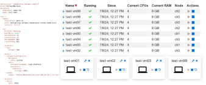

# Welcome to VM-Operator

The goal of this project is to provide easy to use and flexible components
for running Qemu based VMs in Kubernetes pods. 

The image used for the VM pods combines Qemu and a control program
for starting and managing the Qemu process. This application is called
"[the runner](runner.html)".

While you can deploy a runner manually (or with the help of some 
helm templates), the preferred way is to deploy "[the manager](manager.html)"
application which acts as a Kubernetes operator for runners 
and thus the VMs.

If you just want to try out things, you can skip the remainder of this
page and proceed to "[the manager](manager.html)".

## Motivation
The project was triggered by a remark in the discussion about RedHat
[dropping SPICE support](https://bugzilla.redhat.com/show_bug.cgi?id=2030592) 
from the RHEL packages. Which means that you have to run Qemu in a
container on RHEL and derivatives if you want to continue using Spice.
So KubeVirt comes to mind. But
[one comment](https://bugzilla.redhat.com/show_bug.cgi?id=2030592#c4) 
mentioned that the [KubeVirt](https://kubevirt.io/) project isn't
interested in supporting SPICE either.

Time to have a look at alternatives. Libvirt has become a common
tool to configure and run Qemu. But some of its functionality, notably
the management of storage for the VMs and networking is already provided
by Kubernetes. Therefore this project takes a fresh approach of
running Qemu in a pod using a simple, lightweight manager called "runner".
Providing resources to the VM is left to Kubernetes mechanisms as
much as possible.

## VMs and Pods

VMs are not the typical workload managed by Kubernetes. You can neither
have replicas nor can the containers simply be restarted without a major 
impact on the "application". So there are many features for managing
pods that we cannot make use of. Qemu in its container can only be
deployed as a pod or using a stateful set with replica 1, which is rather
close to simply deploying the pod (you get the restart and some PVC
management "for free").

A second look, however, reveals that Kubernetes has more to offer.
* It has a well defined API for managing resources.
* It provides access to different kinds of managed storage for the VMs.
* Its managing features *are* useful for running the component that
manages the pods with the VMs.

And if you use Kubernetes anyway, well then the VMs within Kubernetes 
provide you with a unified view of all (or most of) your workloads,
which simplifies the maintenance of your platform.
