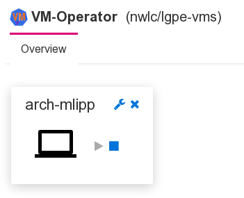

# User view

*Since 3.0.0*

The idea of the user view is to provide an intuitive widget that
allows the users to access their own VMs and to optionally start
and stop them.



The configuration options resulting from this seemingly simple
requirement are unexpectedly complex.

## Control access to VMs

First of all, we have to define which VMs a user can access. This
is done using the optional property `spec.permissions` of the 
VM definition (CRD).

```yaml
spec:
  permissions:
  - role: admin
    may: 
    - "*"
  - user: test
    may:
    - start
    - stop
    - accessConsole 
```

Permissions can be granted to individual users or to roles. There
is a permission for each possible action. "*" grants them all.

## Simple usage vs. expert usage

Next, there are two ways to create the VM widgets (preview conlets
in the framework's terms). They can be created on demand or
automatically for each VM that a logged in user has permission to
access. The former is the preferred way for an administrator who
has access to all VMs and needs to open a particular VM's console
for trouble shooting only. The latter is the preferred way
for a regular user who has access to a limited number of VMs.
In this case, creating the widgets automatically has the additional
benefit that regular users don't need to know how to create and
configure the widgets using the menu and the properties dialog.

Automatic synchronization of widgets and accessible VMs is controlled
by the property `syncPreviewsFor` of the VM viewer. It's an array with
objects that either specify a role or a user.

```yaml
"/Manager":
  # This configures the GUI
  "/GuiHttpServer":
    "/ConsoleWeblet":
      "/WebConsole":
        "/ComponentCollector":
          "/VmAccess":
            syncPreviewsFor:
            - role: user
            - user: test
            displayResource:
              preferredIpVersion: ipv4
```

## Console access

Access to the VM's console is implemented by generating a
[connection file](https://manpages.debian.org/testing/virt-viewer/remote-viewer.1.en.html#CONNECTION_FILE) for virt-viewer when the user clicks on
the console icon. If automatic open is enabled for this kind of
files in the browser, the console opens without further user action.

The file contains all required and optional information to start the
remote viewer.

  * The "host" is by default the IP address of the node that the
    VM's pod is running on (remember that the runner uses host
    networking).
  * The "port" is simply taken from the VM definition.

In more complex scenarios, an administrator may have set up a load
balancer that hides the worker node's IP addresses or the worker
nodes use an internal network and can only be accessed through a
proxy. For both cases, the values to include in the connection file
can be specified as properties of `spec.vm.display.spice` in the
VM definition.

```yaml
spec:
  vm:
    display:
      spice:
        port: 5930
        server: 192.168.19.32
        proxyUrl: http://vms-spice.some.host:1234
        generateSecret: true
```

The value of `server` is used as value for key "host" in the
connection file, thus overriding the default value. The 
value of `proxyUrl` is used as value for key "proxy".

## Securing access

As described [previously](./controller.html#display-secretpassword),
access to a VM's display can be secured with a password. If a secret
with a password exists for a VM, the password is
included in the connection file.

While this approach is very convenient for the user, it is not
secure, because this leaves the password as plain text in a file on
the user's computer (the downloaded connection file). To work around
this, the display secret is updated with a random password with
limited validity, unless the display secret defines a `password-expiry`
in the future or with value "never" or doesn't define a
`password-expiry` at all.

The automatically generated password is the base64 encoded value
of 16 (strong) random bytes (128 random bits). It is valid for 
10 seconds only. This may be challenging on a slower computer 
or if users may not enable automatic open for connection files
in the browser. The validity can therefore be adjusted in the
configuration.

```yaml
"/Manager":
  "/Controller":
    "/DisplaySecretMonitor":
      # Validity of generated password in seconds
      passwordValidity: 10
```

Taking into account that the controller generates a display
secret automatically by default, this approach to securing
console access should be sufficient in all cases. (Any feedback
if something has been missed is appreciated.)
